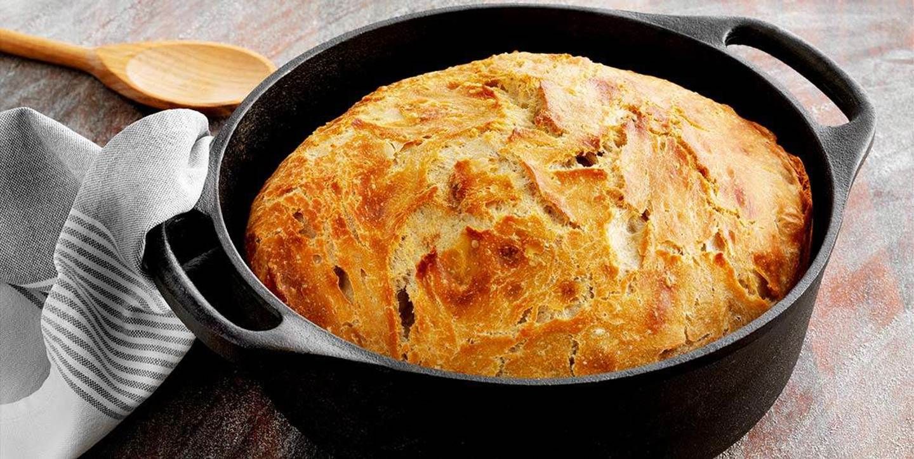

# Recept en övning - Flöde via loopar och strängmanipulation

I denna uppgift så ska ni skapa en enkel hemsida utan någon direkt styling ( förutom browserns default styling ) om ett recept som ni tycker om. Det kan vara er egna paradrätt eller någon rätt som er mamma alltid brukade laga till er när ni var små.

### Kravspecifikation

- En header-tagg som innehåller en rubrik i form av en h-tagg som en inledande beskrivning av receptet och kanske varför du har valt just detta recept.

- Minst två bilder ska finnas med, och båda ska innehålla attributet _alt_. Hur ni väljer att placera bilderna och i vilket syfte får ni avgöra själv. Men någon form av omslagsbild kan i alla fall vara bra. Bilderna kan ni googla fram.

- En tydlig sektion där ni listar ingredienserna i en “bullet-list”. Element som måste användas _( men ej begränsat till )_: section, ul och li.

- En tydlig sektion där ni listar instruktionerna till receptet Element som måste användas _( men ej begränsat till )_: section, ol och li.

- En footer-tag där ni listar lite kontaktuppgifter till er själv _( kan vara påhittad information )_. Det kanske är en restaurang eller konditori där ute som vill anställa er på grund av att ert recept ser så smaskigt ut!

- CSS! _( Vänta med denna till efter CSS-omgång )_ Styling är viktigt och ska finnas med, och det ska vara ordentlig. Tips är att styla er receptsida efter ert recept, alltså använda som team som rätten går i, färger och så.

  <figure></figure>
  <figure></figure>